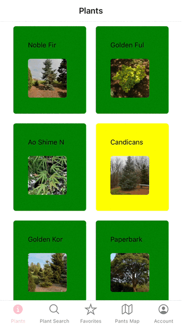
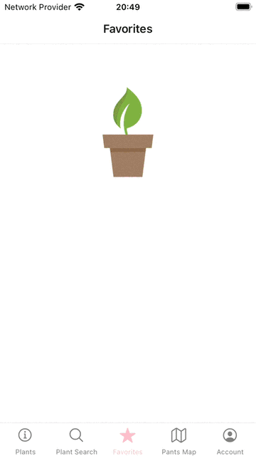
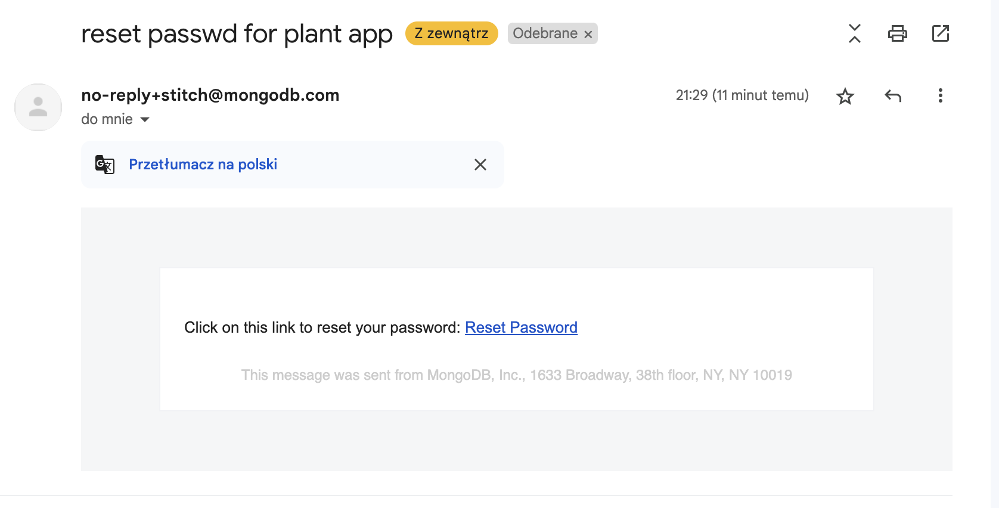

# React Native Plant App
[Jira](https://roleplantingapp.atlassian.net/jira/software/projects/RPA/boards/1) 

# Running the App (ios simulator)

```
git clone https://github.com/incubo4u/PlantApp
cd PlantApp
npm ci 
npm run ios 
// or 
npm run android
```

This gif offers a general overview of the app


## User Documentation
The app consists of:
- Login screen 
- Create account screen 
- Plant list screen
- Plant search screen 
- Favorites screen 
- Map screen
- Account screen 

This collection of GIFs showcases various features of the React Native Plant App.
(The app supports dark mode 🌙)

## Plant List
The plant list screen allows you to explore plants by scrolling the plant list. Long-press a plant to mark it as one of your favorites (colored in yellow). Access your favorite plants in the favorites screen. Long-press again to remove a plant from favorites. Tap a plant to view detailed information on a scrollable screen.




## Search
This screen lets you find plants by name. Enter a plant's name in the search bar and tap the result to view plant information.


## Favorites List
View all your favorite plants in one place. Remove a plant from favorites by long-pressing it.




## Map
Save a plant's position on the map by typing its name and long-pressing the desired spot. Handy for marking spots in the wild or remembering plant locations.


## User Account
This screen allows you to input your name, nickname, and other personal information. It also offers a log-out button.


To initiate the password reset process, click the "Reset Password" button. An email will be promptly dispatched with instructions on how to reset your password. Simply follow the provided steps in the email to complete the password reset.


